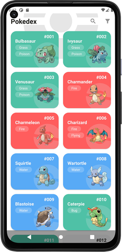
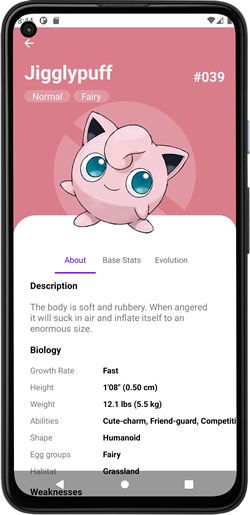

[](https://developer.android.com/)
[](https://android-arsenal.com/api?level=23)





# Description
A simple android app that list all 151 original pokemons. This application get data from [PokeAPI](https://pokeapi.co/) through GraphQL requests and implements the MVVM architecture.

## Build with
- ViewModel
- ViewBinding
- Coroutines
- LiveData
- Navigation Component
- [Apollo Android](https://www.apollographql.com/docs/android/) - GraphQL client that generates Java and Kotlin models from GraphQL queries.
- [Hilt-Dagger](https://dagger.dev/hilt/) - Dependency injection
- [Glide](https://bumptech.github.io/glide/) - Image loading library 
- [FlexBox Layout](https://github.com/google/flexbox-layout) - Was used to list de poke types in types.xml and fragment_filter_dialog.xml

## License
```
MIT License

Copyright (c) 2021 Jeff Sares

Permission is hereby granted, free of charge, to any person obtaining a copy
of this software and associated documentation files (the "Software"), to deal
in the Software without restriction, including without limitation the rights
to use, copy, modify, merge, publish, distribute, sublicense, and/or sell
copies of the Software, and to permit persons to whom the Software is furnished
to do so, subject to the following conditions:

The above copyright notice and this permission notice shall be included in
all copies or substantial portions of the Software.

THE SOFTWARE IS PROVIDED "AS IS", WITHOUT WARRANTY OF ANY KIND, EXPRESS OR IMPLIED,
INCLUDING BUT NOT LIMITED TO THE WARRANTIES OF MERCHANTABILITY, FITNESS FOR A
PARTICULAR PURPOSE AND NONINFRINGEMENT. IN NO EVENT SHALL THE AUTHORS OR COPYRIGHT
HOLDERS BE LIABLE FOR ANY CLAIM, DAMAGES OR OTHER LIABILITY, WHETHER IN AN ACTION
OF CONTRACT, TORT OR OTHERWISE, ARISING FROM, OUT OF OR IN CONNECTION WITH THE
SOFTWARE OR THE USE OR OTHER DEALINGS IN THE SOFTWARE.
```
