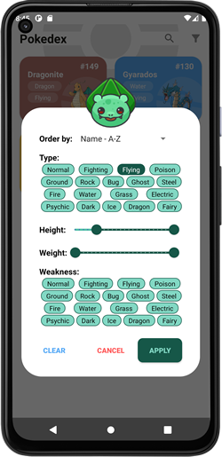
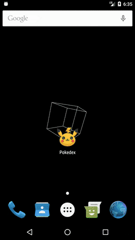

# Description
A simple android app that list all 151 original pokemons. This application get data from [PokeAPI](https://pokeapi.co/) through GraphQL requests and implements the MVVM architecture.

## Build with
- ViewModel
- ViewBinding
- Coroutines
- LiveData
- Navigation Component
- [Apollo Android](https://www.apollographql.com/docs/android/) - GraphQL client that generates Java and Kotlin models from GraphQL queries.
- [Hilt-Dagger](https://dagger.dev/hilt/) - Dependency injection
- [Glide](https://bumptech.github.io/glide/) - Image loading library 
- [FlexBox Layout](https://github.com/google/flexbox-layout) - Was used to list de poke types in types.xml and fragment_filter_dialog.xml